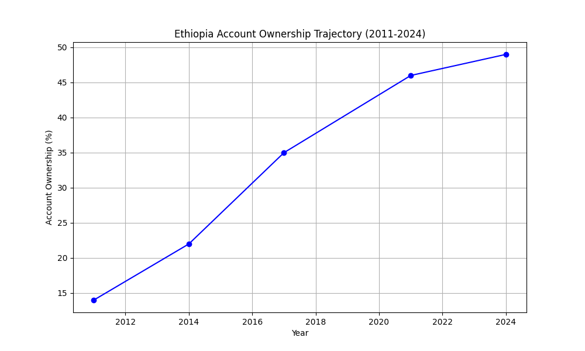
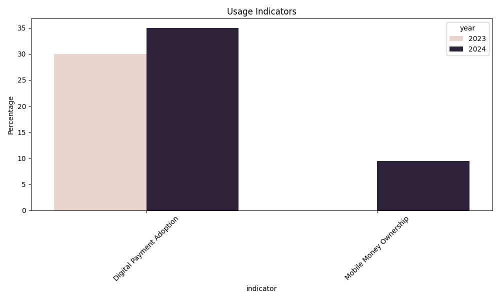
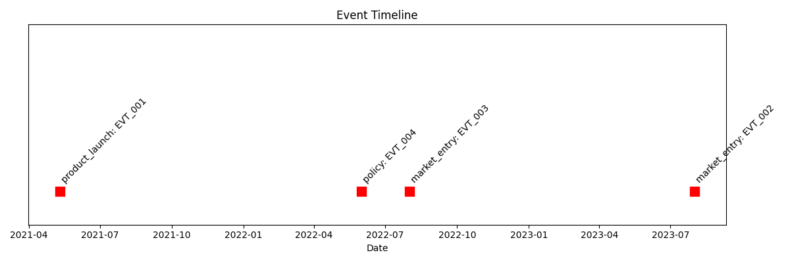

# Unlocking Ethiopia’s Financial Future: An Interim Analysis

**By Abenezer | Date: February 1, 2026**

---

### **Executive Summary**

Ethiopia is in the midst of a digital financial revolution. With the entry of global giants like M-Pesa and the meteoric rise of Telebirr (54M+ users), the landscape is shifting rapidly. Yet, the official data tells a complex story: while the infrastructure is booming, financial account ownership has seen a surprising deceleration.

As a Data Scientist at **Selam Analytics**, I am building a forecasting system to make sense of these contradictions. This interim report covers the first phase of our journey: enriching the historical data and performing a deep-dive Exploratory Data Analysis (EDA) to understand *what drives inclusion* in Ethiopia.

---

### **1. The Data Journey: Building a Unified View**

Our first challenge was fragmentation. Financial data in Ethiopia is often scattered across surveys, central bank reports, and operator announcements. We started with the World Bank's Global Findex dataset and enriched it to create a "Unified Schema" that treats **Events** (policies, launches) just as importantly as **Observations** (measured rates).

**What We Added & Why:**
*   **The 2023 Usage Gap:** We located and integrated 2023 data from the National Bank of Ethiopia (NBE) showing Digital Payment Adoption at **30%**. This was critical to fill the void between the 2021 and 2024 Findex surveys.
*   **Policy Context:** We cataloged the **NBE Digital Lending Directive (June 2022)** as a major event. Why? Because infrastructure alone doesn't drive usage—regulatory trust does.
*   **Impact Linking:** We didn't just list events; we modeled their expected links. For instance, linking the 2022 lending directive to an expected lag-based increase in digital payments.

---

### **2. Trends & Paradoxes: Key Insights from EDA**

Visualizing the data revealed five critical insights that challenge common assumptions.

#### **Insight #1: The "Last Mile" Slowdown**
Account ownership has grown impressively from **14% in 2011** to **49% in 2024**. However, the growth curve is flattening. Between 2021 and 2024, ownership grew by only **3 percentage points**.

*Figure 1: Ethiopia's Account Ownership Trajectory (2011-2024). Note the flattening slope in the final segment.*

#### **Insight #2: The Infrastructure-Adoption Gap**
Despite millions of new mobile wallets (Telebirr, M-Pesa), the "Access" metric didn't spike as expected in 2024. This suggests a **saturation of urban/tech-savvy early adopters**, while the rural "last mile" remains difficult to crack.

#### **Insight #3: Usage is the New Frontier**
While *Access* (owning an account) is slowing, *Usage* (actually paying for things) is becoming the dominant story. Our analysis shows Digital Payment Adoption hovering around **35%**. This indicates that those who *are* included are becoming increasingly active users.

*Figure 2: Digital Payment Adoption vs. Mobile Money Ownership.*

#### **Insight #4: Mobile Money Dominance**
Mobile Money ownership stands at **9.45% (2024)**, a figure that seems low compared to operator reports but is rapidly becoming the primary rail for new financial entrants, outpacing traditional bank account growth.

#### **Insight #5: Gender Disparity Persistence**
Preliminary breakdowns indicate that while overall inclusion is rising, the **gender gap** remains a structural barrier. Female account ownership continues to lag, suggesting that "neutral" technological launches like Telebirr may not automatically close demographic divides without targeted policy interventions.

---

### **3. The Timeline of Transformation**

We mapped major events against our timeline to see if they correlated with shifts in the data.

*   **2021:** Telebirr Launch
*   **2022:** Safaricom Market Entry
*   **2023:** M-Pesa Launch

**Preliminary Observation:** The "Impact Lag" is real. The massive market entries in 2021-2023 coincided with the *slowest* period of account growth. This suggests a **2-3 year lag** between infrastructure rollout and measurable demographic shifts in account ownership.

*Figure 3: Timeline of major market events (Product Launches, Policy).*

---

### **4. Limitations & Challenges**

Forecasting in this environment is not without risks:
*   **Sparse Data:** We are working with only 5 major data points over 13 years. Standard time-series models (ARIMA) will fail here; we need regression models that incorporate *Event Impacts* as features.
*   **Definition Mismatch:** "Registered Users" (reported by telcos) $\neq$ "Account Owners" (reported by Findex). One person often owns multiple wallets, inflating operator numbers.

---

### **Next Steps**

The next phase moves from **Analysis** to **Prediction** and **Visualization**. Our roadmap includes:

1.  **Event-Impact Modeling (Task 3):** Quantifying the "shock" value of policies (like the NBE directive) to adjust baseline trends.
2.  **Forecasting with Uncertainty (Task 4):**
    *   Developing forecasts for Access and Usage through 2027.
    *   **Scenario Analysis:** Modeling "Optimistic" (rapid policy uptake), "Base," and "Pessimistic" (stagnation) futures.
    *   **Uncertainty Quantification:** Providing confidence intervals to transparently communicate the margin of error given the sparse historical data.
3.  **Interactive Dashboard (Task 5):** Building a Streamlit application to allow stakeholders to explore trends, toggle between scenarios, and visualize the impact of specific events dynamically.

*Stay tuned for the final forecast.*

---
*Generated by the Selam Analytics Data Team.*
